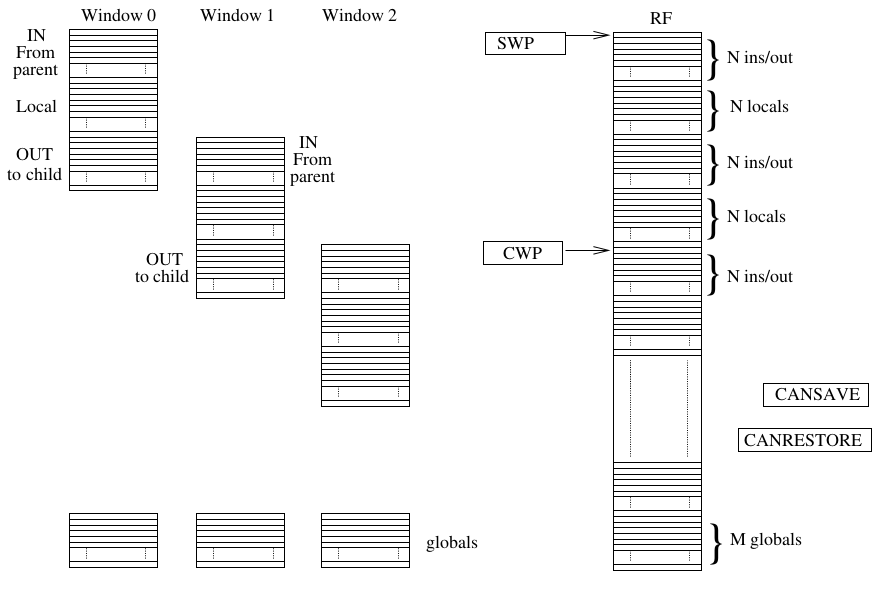

# Windowed Register File (RF_WINDOWED)

## Overview

This repository contains the VHDL code for a **Windowed Register File (RF_WINDOWED)**, which is a specialized register file for handling multiple windows of data with a dynamic, efficient management strategy. The design supports multiple registers organized in windows, with a set of registers that can be accessed as needed, allowing for efficient storage, retrieval, and management of register data.

The core concept is to provide a register file that can dynamically manage multiple windows of data (with both local and global registers), offering functionality for reading, writing, and switching between registers across these windows. It is especially useful for systems requiring a high degree of flexibility in managing registers, such as embedded systems with limited resources.



## Capabilities

The windowed register file supports the following key features:
- **Multiple Windows**: The register file is divided into multiple windows, each containing a set of registers. The number of windows is defined by the `F` parameter.
- **Dynamic Window Management**: Registers can be saved to memory and restored from memory as needed.
- **Read/Write Operations**: Supports both read and write operations, allowing for flexible manipulation of register data.
- **Addressing Scheme**: The register file can address different categories of registers: input, output, and local registers for each window, as well as global registers.
- **Circular Buffering**: The current window pointer (CWP) operates in a circular buffer mode, ensuring continuous management of windowed registers.
- **Spilling and Restoring**: When all windows are used, a "spill" operation occurs to save the data to memory, and when required, the data can be restored via the `RET` signal, and the `FILL` signal will indicate the completion of the restoration.

## Signals

- `CLK`: Clock signal.
- `RESET`: Synchronous reset to clear all registers.
- `ENABLE`: Enables read/write operations.
- `CALL`: Triggers the transition to the next window.
- `RET`: Triggers the transition back to the previous window.
- `RD1`, `RD2`: Read enable signals for two output registers.
- `WR`: Write enable signal.
- `DATABUS`: Bidirectional data bus for communication with external components.
- `ADD_WR`: Address for the write operation.
- `ADD_RD1`, `ADD_RD2`: Addresses for read operations.
- `FILL`: Signal indicating a completed restoration process.

## Folder Structure

```
.
├── functioning_scheme.png
├── README.md
├── sim
│   ├── modelsim.ini
│   ├── REGFILE_WINDOWED.pdf
│   ├── simulation.tcl
│   ├── vsim.wlf
│   └── work
│       ├── _info
│       ├── _lib1_0.qdb
│       ├── _lib1_0.qpg
│       ├── _lib1_0.qtl
│       ├── _lib.qdb
│       └── _vmake
├── src
│   └── RF_WINDOWED.vhd
├── syn
│   ├── RF_w_1t.rpt
│   ├── RF_w_2t.rpt
│   ├── RF_w-behavioral.ddc
│   ├── RF_w_clk.rpt
│   └── RF_w.scr
└── tb
    └── tb.vhd
```

### Description of Folders and Files
- **functioning_scheme.png**: Diagram illustrating the functioning of the register file.
- **README.md**: Documentation file (this file).
- **sim/**: Contains simulation-related files, including the TCL scripts, waveform files, and simulation reports.
  - `modelsim.ini`: Initialization file for ModelSim.
  - `REGFILE_WINDOWED.pdf`: Detailed documentation and explanation of the design.
  - `simulation.tcl`: TCL script for running simulations.
  - `vsim.wlf`: Waveform log file.
  - `work/`: Contains simulation work library files.
- **src/**: Contains the main VHDL source file (`RF_WINDOWED.vhd`).
- **syn/**: Contains synthesis-related files and reports.
  - `RF_w-behavioral.ddc`: Behavioral synthesis database.
  - `RF_w_clk.rpt`: Clock analysis report.
  - `RF_w.scr`: Synthesis script file.
- **tb/**: Contains the testbench VHDL file (`tb.vhd`).

## Compilation Instructions

1. **Simulation**:
   - Open your ModelSim/QuestaSim environment.
   - Navigate to the `sim` folder.
   - Run the `simulation.tcl` script to set up and execute the simulation:
     ```
     do simulation.tcl
     ```
   - Observe the results in the waveform viewer (`vsim.wlf`).

2. **Synthesis**:
   - Navigate to the `syn` folder.
   - Use your preferred synthesis tool to process the `RF_WINDOWED.vhd` file. Example (for Synopsys Design Compiler):
     ```
     dc_shell -f RF_w.scr
     ```
   - Review the generated reports (`RF_w_1t.rpt`, `RF_w_2t.rpt`, etc.) for synthesis metrics.

3. **Testing**:
   - Navigate to the `tb` folder.
   - Compile the `tb.vhd` testbench along with `RF_WINDOWED.vhd` using your VHDL simulator.
   - Run the simulation to verify the functionality of the register file.

### Notes
- Ensure all dependencies are correctly configured in the environment.
- Modify `modelsim.ini` or synthesis scripts if needed for your specific setup.
- For detailed design information, refer to `REGFILE_WINDOWED.pdf` in the `sim` folder.

## Conclusion

The Windowed Register File (RF_WINDOWED) is a robust and flexible design suitable for embedded systems requiring efficient register management. By following the provided instructions, you can simulate, synthesize, and test the design to fit your specific application needs.


